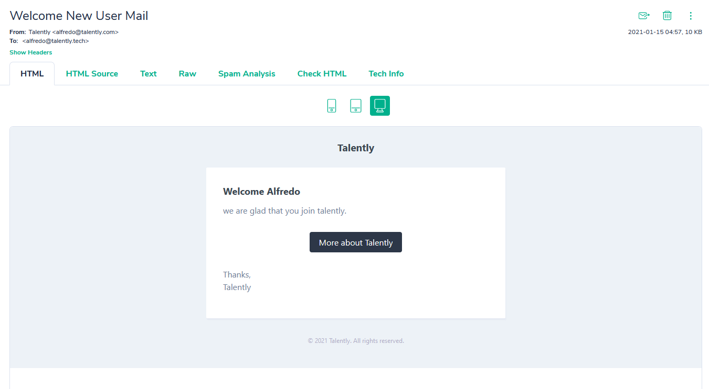
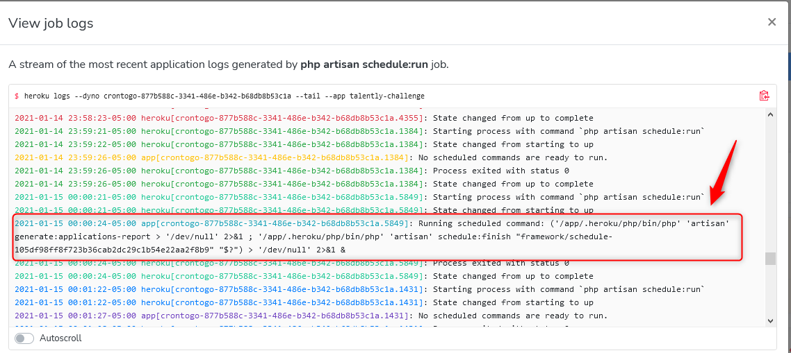

# Prueba técnica Talently

- API URL: `https://talently-challenge.herokuapp.com`
- Default User:
    ```json
    {
        "email": "cristian@talently.tech",
        "password": "password"
    }
    ```

## Endpoints

### Authentication

1. Login [POST] `/api/v1/login`:
    - Body:
        ```json
        {
            "email": "cristian@talently.tech",
            "password": "password"
        }
        ```
    - Returns a Bearer Token:
        ```json
        {
            "token": "V5dzd1YCwGgoMTIHhrQXUhWlIklLNePX4tGWzrR6"
        }
        ```
2. Register [POST] `/api/v1/register`:
    - Body:
         ```json
        {
            "email": "alfredo@talently.tech",
            "name": "Alfredo",
            "password": "password",
            "password_confirmation": "password"
        }
        ```
    - Returns a Bearer Token:
        ```json
        {
            "token": "V5dzd1YCwGgoMTIHhrQXUhWlIklLNePX4tGWzrR6"
        }
    - It sends an email to Mailtrap:
        
3. Logout [POST] `/api/v1/logout`

### Application

Needs Bearer Token `Authorization: Bearer ${TOKEN}`

1. [GET] `/api/v1/applications`: Get all applications of the current authenticated user.
2. [POST] `/api/v1/applications`: Create a new application.
    - Body:
         ```json
        {
            "name": "string",
            "description": "string",
            "company": "string",
            "phase_id": 1,
            "application_date": "2021-01-12"
        }
        ```
3. [GET] `/api/v1/applications/{application_id}`: Get an application.
4. [PUT] `/api/v1/applications/{application_id}`: Update an application.
    - Body:
         ```json
        {
            "name": "string",
            "description": "string",
            "company": "string",
            "phase_id": 1,
            "application_date": "2021-01-12"
        }
        ```
5. [DELETE] `/api/v1/applications/{application_id}`: Delete an application.
6. [PATCH] `/api/v1/applications/{application_id}/change-phase`: Change the application phase.
    - Body:
         ```json
        {
            "phase_id": 1
        }
        ```
7. [GET] `/api/v1/generated-reports`: Get all the report files


> This resources has the rule that only the authenticated user can interact with his applications. (This is validated by Policies provided by Laravel and also they are asserted in the tests).

### Task Scheduler (Cron Job)

An artisan command was implemented to export a CSV file report with the quantity of applicants by phase. Command: `php artisan generate:applications-report`

A cron job is running on the server executing the command:


